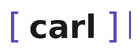

<p align="center">
  
</p>

<p align="center">
  <strong>AI code review on every pull request. Any model. Zero infrastructure.</strong>
</p>

carl is a GitHub Action that reads your PR diff, looks up the linked issue to understand the task, and posts a review comment. One `.yml` file. No servers. No subscriptions.

```yaml
- uses: deyna256/carl@v1
  with:
    openrouter-api-key: ${{ secrets.OPENROUTER_API_KEY }}
```

## What carl does

On every PR open or push:

1. Fetches the diff and the linked issue from GitHub
2. Loads your review guidelines from `.github/carl.md`
3. Asks the model: _did this PR solve the task, and is the code correct?_
4. Posts the answer as a PR review comment

If the diff exceeds `max_diff_chars` or `max_files`, carl fails fast with a clear error. If OpenRouter is unavailable, it posts a notice instead of silently failing.

## Quick start

**1. Add your OpenRouter key to repository secrets**

`Settings → Secrets and variables → Actions → New repository secret`  
Name: **`OPENROUTER_API_KEY`**

**2. Create `.github/carl.yml`**

```yaml
model: google/gemma-4-26b-a4b-it
guidelines: .github/carl.md
max_diff_chars: 20000
max_files: 10
ignore:
  - '*.lock'
  - 'dist/**'
```

**3. Create `.github/carl.md` — tell carl what to look for**

```md
Check whether the PR solves the linked issue.
Then review the code for logic errors, security issues, and missing test coverage.
Skip stylistic comments.
```

**4. Add `.github/workflows/carl.yml`**

```yaml
on:
  pull_request:
    types: [opened, synchronize]

jobs:
  review:
    runs-on: ubuntu-latest
    permissions:
      pull-requests: write
    steps:
      - uses: actions/checkout@v4
      - uses: deyna256/carl@v1
        with:
          openrouter-api-key: ${{ secrets.OPENROUTER_API_KEY }}
```

> **Private repository?** The default token won't work. See [configuration → private repositories](docs/config.md#private-repositories).

## Why carl

- **Any model.** Switch from Claude to Gemini to Llama by changing one line in `carl.yml` — no code changes.
- **Your guidelines.** The review prompt lives in your repository. Tailor it to your stack, your standards, your team.
- **Linked issue awareness.** carl fetches the GitHub issue linked to the PR and tells the model what problem was supposed to be solved — so it can judge whether it actually was.
- **No infrastructure.** Runs entirely inside GitHub Actions. Nothing to host, nothing to maintain.

## Inputs

| Input | Required | Default | Description |
| --- | --- | --- | --- |
| `openrouter-api-key` | **yes** | — | Your OpenRouter API key |
| `github-token` | no | `${{ github.token }}` | GitHub token with `pull-requests: write` permission |
| `config-path` | no | `.github/carl.yml` | Path to carl config file |

## Docs

- [Configuration reference](docs/config.md) — all `carl.yml` options, writing `carl.md`, private repo setup
- [Project structure](docs/structure.md) — architecture, source modules, CI/CD

## Requirements

- GitHub repository (public or private)
- [OpenRouter](https://openrouter.ai) account with API key
- Any model available on OpenRouter
